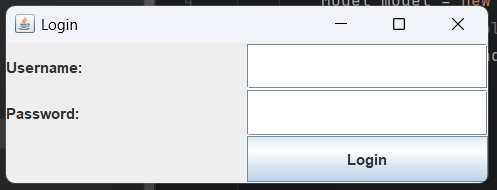
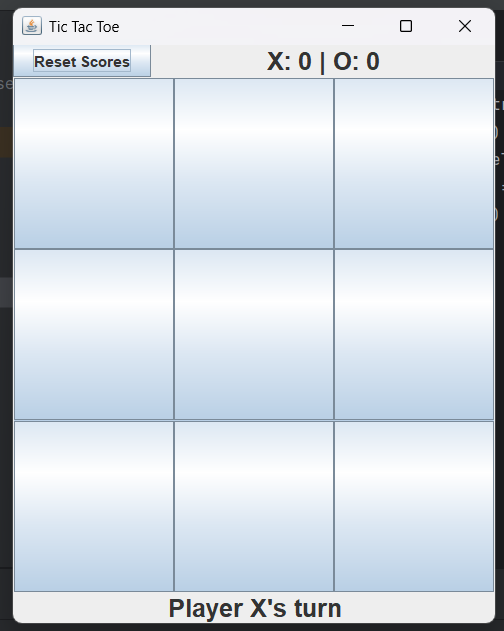
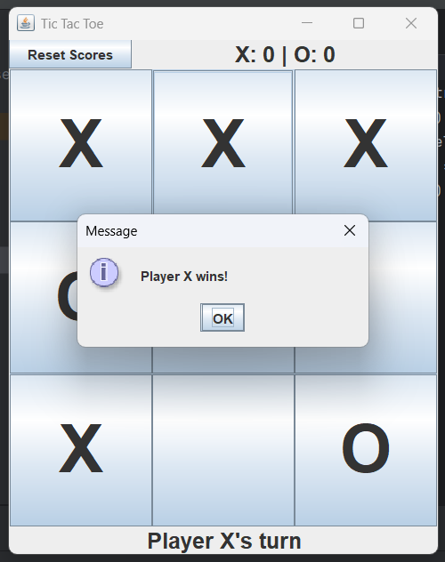
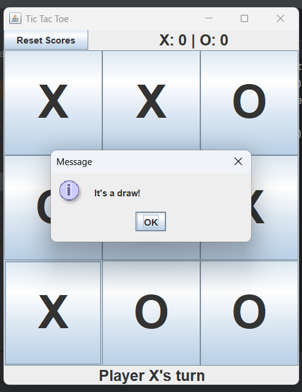

# Tic Tac Toe (Java Swing)

Game Overview
| Login |
|-------|
|  |

| Game Board |
|------------|
|  |

| Win |
|-----|
|  |

| Draw |
|------|
|  |

A classic Tic Tac Toe game with:
- GUI using Java Swing
- MVC architecture
- Player vs Player mode

## How to Run
1. Clone repository
2. Open in IntelliJ/Eclipse
3. Run `Main.java`
